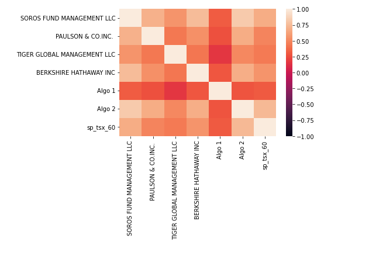
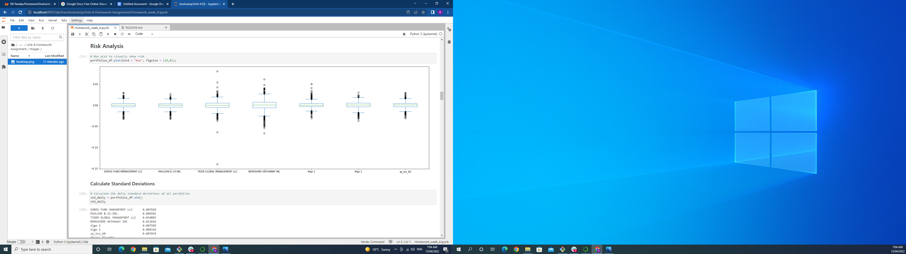
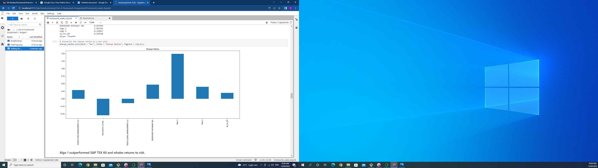
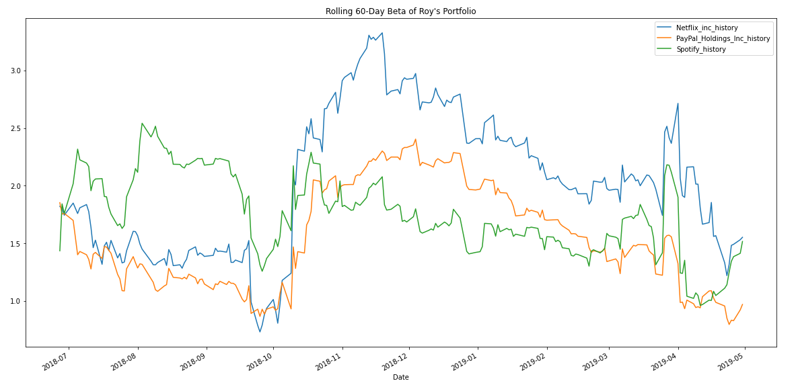

# Unit-4 - A Whale off the Port(folio)
## Harold's company has been investing in algorithmic trading strategies. Some of the investment managers love them, some hate them, but they all think their way is best. ##
## Using quantitative analysis techniques with Python and Pandas analysis notebook we can determine which portfolio is performing the best across multiple areas: volatility, returns, risk, and Sharpe ratios. ## 

--------

## Technologies

This notebook leverages Python 3.8 with the following packages in a Jupyter Notebook:
- Pandas
- Matplotlib
- numpy 
- datetime 
- matplotlib
---

## Installation Guide

Before running the notebook, please install the dependencies:

```python
pip install pandas
pip install numpy
pip install matplotlib
pip install datetime
pip install seaborn

```

---

## Observations

### Algo 1 outperformed S&P TSX 60 and whales returns to risk.###
### While algo 2 fell below S&P TSX 60 and BERKSHIRE HATHAWAY INC returns to risk but outperformed SOROS FUND MANAGEMENT LLC, PAULSON & CO.INC., TIGER GLOBAL MANAGEMENT LLC. ###
### Roy's Portfolios holding of PayPal out performed S&P TSX 60 but Netflix and Spotify were out performed by S&P TSX 60 ###
### The images below show correlation between the portfolio's, the returns to risk, a Sharpe Ratio comparison and  Rolling 60-Day Beta of Roy's Portfolio ###









## All coding used to produce these plots and more plots of the data used compare portfolios can be found in [ipynb_file]("Homework_week_4.ipynb") 
---

## Contributors

By: Roy Booker

---

## License

MIT